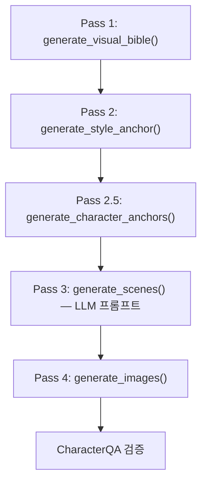
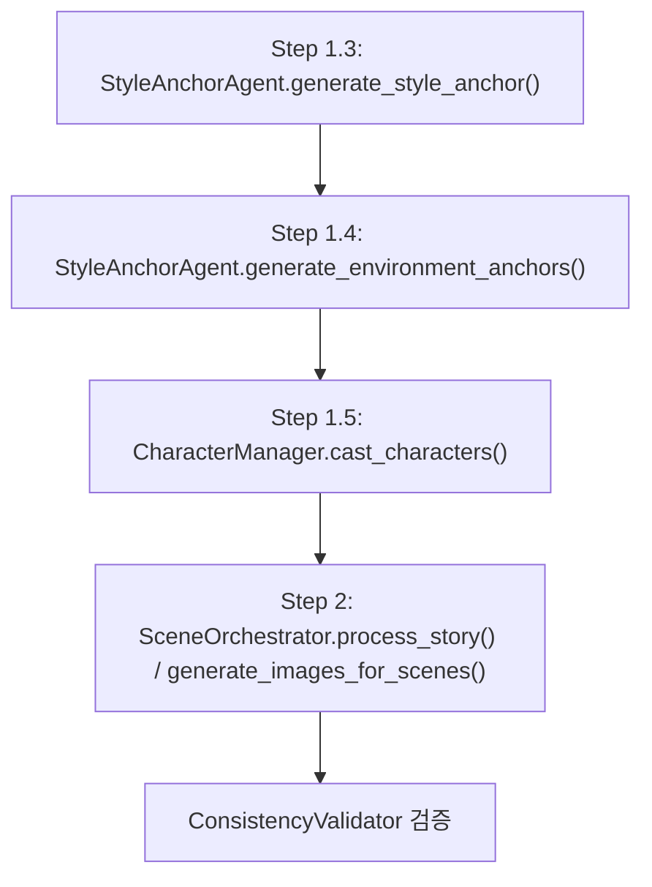

# 뮤비 vs 영상생성 앵커 시스템 비교 분석

## 개요

Storycut 프로젝트에는 두 개의 독립적인 파이프라인이 있으며, 각각 고유한 앵커 시스템을 구현합니다:

| 구분 | **뮤비 (MV Pipeline)** | **영상생성 (Storycut Pipeline)** |
|---|---|---|
| 핵심 파일 | [mv_pipeline.py](file:///c:/Project/storycut/agents/mv_pipeline.py) | [pipeline.py](file:///c:/Project/storycut/pipeline.py) + [scene_orchestrator.py](file:///c:/Project/storycut/agents/scene_orchestrator.py) |
| 데이터 모델 | `MVProject` + `VisualBible` + `MVCharacter` | `Manifest` + `GlobalStyle` + `CharacterSheet` |
| 입력 | 음악 파일 + 가사 + 컨셉 | 스토리 텍스트 + 장르/분위기 |

---

## 1. 앵커 생성 흐름 비교

### 뮤비 (MVPipeline) — 4-Pass 시스템

1. **Pass 1 — VisualBible 생성** (`generate_visual_bible`)
   - GenreProfile YAML + LLM(Gemini)으로 전체 비주얼 가이드 생성
   - 색상 팔레트, 조명 스타일, 반복 모티프, 캐릭터 정의, 씬 블로킹, 서사 구조 포함
   - MV 전용 `VisualBible` Pydantic 모델에 저장

2. **Pass 2 — 스타일 앵커** (`generate_style_anchor`)
   - VisualBible 기반 독립적 앵커 프롬프트 구성
   - `atmosphere` + `color_palette` + `lighting_style` + `motifs` + `reference_artists` 결합
   - 캐릭터 없는 순수 스타일 시연 이미지 1장

3. **Pass 2.5 — 캐릭터 앵커** (`generate_character_anchors`)
   - `CharacterManager.cast_mv_characters()` 호출
   - **멀티포즈**: front, three_quarter, full_body 등 포즈별 후보 2장 생성
   - **Gemini Vision 채점**: 각 후보를 자동 품질 평가하여 best 선택
   - **CharacterQA**: 앵커 이미지의 face embedding 128D 벡터 등록
   - 실패 시 `_generate_character_anchors_simple()` 폴백 (1장, 채점 없음)

4. **Pass 4 — 씬 이미지 생성** (`generate_images`)
   - `_get_character_anchors_for_scene()`: **shot_type 기반 포즈 선택**
     - close-up → front 포즈, wide → full_body 포즈
   - `_inject_character_descriptions()`: 외형+의상+action_pose+expression 강제 주입
   - 렌즈 왜곡 방지 토큰, 손 품질 강화 토큰 자동 추가
   - CharacterQA로 생성 이미지 vs 앵커 임베딩 검증 (similarity threshold)

---

### 영상생성 (StorycutPipeline) — 3-Step 시스템

1. **Step 1.3 — 스타일 앵커** (`StyleAnchorAgent.generate_style_anchor`)
   - `GlobalStyle` 객체 기반 프롬프트
   - `art_style` + `color_palette` 조합
   - 캐릭터 없는 establishing shot 1장
   - `visual_seed` 사용하여 재현성 확보

2. **Step 1.4 — 환경 앵커** (`StyleAnchorAgent.generate_environment_anchors`)
   - **씬별** 환경 기준 이미지 생성 (MV에는 없는 기능)
   - 캐릭터 토큰 자동 제거 (`STORYCUT_*` 패턴 + 인물 관련 단어)
   - `visual_seed + scene_id`로 씬별 고유 시드

3. **Step 1.5 — 캐릭터 캐스팅** (`CharacterManager.cast_characters`)
   - `CharacterSheet` 딕셔너리 기반
   - 이미지 전용 모드: 포즈 1개(front), 후보 1장으로 **경량화**
   - 멀티포즈 + Gemini Vision 채점 지원 (full pipeline에서는 활성화)

4. **Step 2 — 씬 이미지 생성** (`SceneOrchestrator`)
   - `CharacterManager.get_pose_appropriate_image()` 호출로 포즈 선택
   - `style_anchor_path` + `environment_anchor_path` 를 `ImageAgent.generate_image()`에 전달
   - `ConsistencyValidator`로 앵커 vs 생성 이미지 일관성 검증

---

## 2. 핵심 차이점

### 데이터 구조

| 항목 | **뮤비** | **영상생성** |
|---|---|---|
| 스타일 정의 | `VisualBible` (LLM 생성, 풍부한 메타데이터) | `GlobalStyle` (StoryAgent 생성, 간결) |
| 캐릭터 모델 | `MVCharacter` (role, outfit, appears_in, face_embedding) | `CharacterSheet` (token, name, appearance, visual_seed) |
| 씬 블로킹 | `MVSceneBlocking` (shot_type, action_pose, expression, visual_continuity) | 없음 (context carry-over만) |
| 서사 구조 | `MVNarrativeArc` (acts 단위 톤 시퀀스) | 없음 |

### 앵커 생성 비교

| 항목 | **뮤비** | **영상생성** |
|---|---|---|
| 스타일 앵커 | MVPipeline 자체 구현 (VisualBible 기반) | `StyleAnchorAgent` 클래스 (독립 모듈) |
| 환경 앵커 | ❌ 없음 | ✅ 씬별 환경 앵커 생성 |
| 캐릭터 포즈 | 멀티포즈 (front, three_quarter, full_body 등) | 이미지 전용 시 front만, 풀 파이프라인에서 멀티포즈 |
| 후보 수 | 포즈당 2장 + Vision 채점 | 이미지 전용 시 1장, 풀 파이프라인에서 2장 |
| Face Embedding | ✅ CharacterQA (128D) | ❌ |
| 스타일별 디렉티브 | ✅ `_style_directives` (anime, webtoon, hoyoverse 등 7종) | 없음 (art_style 문자열만) |

### 씬 이미지 생성 시 앵커 활용

| 항목 | **뮤비** | **영상생성** |
|---|---|---|
| 포즈 선택 | shot_type → pose 매핑 (scene_blocking 참조) | scene prompt 맥락 기반 (`get_pose_appropriate_image`) |
| 캐릭터 설명 주입 | `_inject_character_descriptions()` (외형+의상+action_pose+expression+lens token) | 간단한 `[name] appearance` 문자열 결합 |
| 렌즈 보정 | ✅ 50mm/85mm 렌즈 토큰 자동 선택 | ❌ |
| 손 품질 강화 | ✅ 2인 이상 씬에서 자동 추가 | ❌ |
| 인종 주입 | ✅ ethnicity_keyword 자동 주입 | ✅ 동일 방식 |
| 시대 배경 | ✅ era_prefix/era_negative 자동 감지+주입 | ❌ |
| 검증 | CharacterQA (face embedding similarity) | ConsistencyValidator (Vision-based) |
| Negative prompt | 씬 맥락별 동적 구성 (캐릭터 유무, 렌즈 왜곡 등) | 스타일별 고정 negative |

### 후처리 (MV 전용)

| 기능 | 설명 |
|---|---|
| Cut Plan | Subject-aware bbox 기반 크롭 + 세그먼트별 리프레임 시퀀스 |
| Face-safe Padding | 얼굴 bbox 기준 상하좌우 패딩 |
| Ghost 방지 | 연속 close/detail 컷 방지 규칙 |
| Match-cut | 프레이밍 연속성 (±5% 제한) + 모션 방향 연속성 |
| B-roll | Pexels 스톡 영상 통합 (캐릭터 미등장 + 비감정 구간) |
| Transition Plan | 9가지 전환 규칙 (cut, xfade, fadeblack, whiteflash, filmburn, glitch) |

---

## 3. 공유 컴포넌트

두 파이프라인이 공유하는 핵심 모듈:

| 모듈 | 역할 |
|---|---|
| [image_agent.py](file:///c:/Project/storycut/agents/image_agent.py) | Gemini 이미지 생성 (style_anchor_path, character_reference_paths 파라미터) |
| [character_manager.py](file:///c:/Project/storycut/agents/character_manager.py) | 캐릭터 캐스팅 + 멀티포즈 + Vision 채점 |
| [prompt_builder.py](file:///c:/Project/storycut/utils/prompt_builder.py) | 7단계 LOCK 순서 멀티모달 프롬프트 빌더 |
| [style_anchor.py](file:///c:/Project/storycut/agents/style_anchor.py) | 스타일/환경 앵커 생성 (영상생성 전용, MV는 자체 구현) |

> [!IMPORTANT]
> `MultimodalPromptBuilder`의 7단계 LOCK 순서는 두 파이프라인 모두에서 사용되지만, MV 파이프라인은 `build_simple_request()`를, 영상생성 파이프라인은 `build_request()`를 주로 사용합니다.

---

## 4. 요약

**MV 파이프라인**은 음악 기반 특화 앵커 시스템으로, VisualBible이라는 풍부한 메타데이터를 LLM으로 선생성하고, shot_type·action_pose·expression 등 씬 블로킹 정보를 활용하여 더 정교한 캐릭터 연출을 수행합니다. CharacterQA(face embedding)와 subject-aware cut plan 등 후처리 검증도 강력합니다.

**영상생성 파이프라인**은 스토리 기반의 범용 앵커 시스템으로, GlobalStyle + CharacterSheet 기반의 간결한 구조입니다. 대신 **씬별 환경 앵커**라는 MV에 없는 기능이 있으며, ConsistencyValidator로 일관성을 검증합니다. Context Carry-over (맥락 상속)로 씬 간 연속성을 유지하는 것이 특징입니다.
